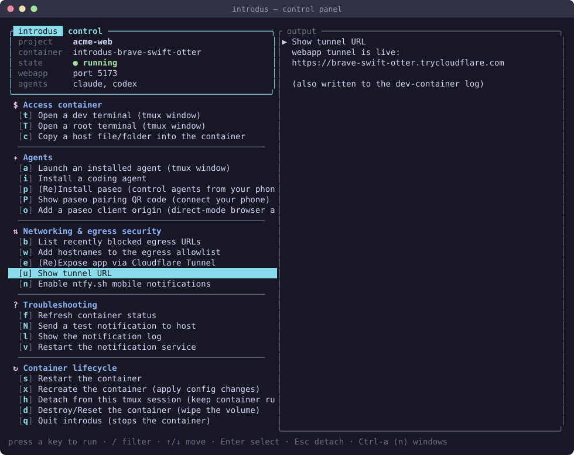
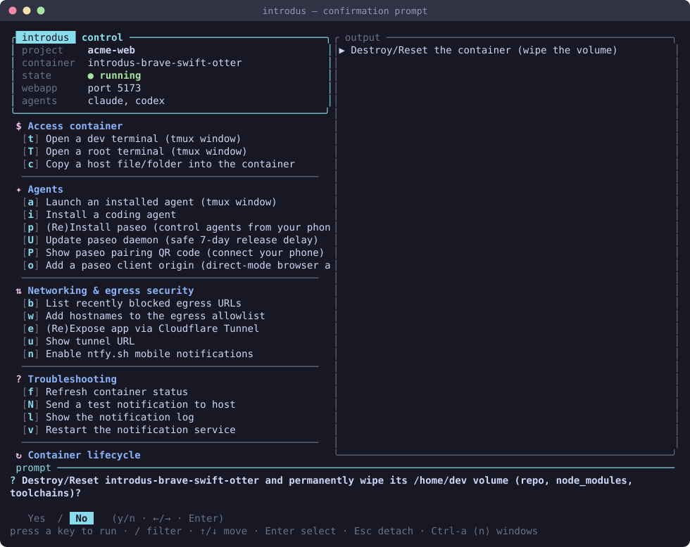

# Control panel (the TUI)

> Part of [introdus](../README.md#features). The full-screen terminal UI you drive each container from.

Every launched container lives inside one **tmux session** with a persistent
two-pane **control panel** in its `main-control` window. The left column is the
live status + the menu — grouped into icon-headed sections, each item carrying a
single-key **hotkey** — and the right column is an output pane where each action
streams its output instead of clearing the screen. Prompts appear as centered
popups over the frame.



## Prerequisites

None beyond a launched container — the panel is what `introdus` (or `introdus
menu`) drops you into. `tmux` must be installed on the container host (it's a
[launch prerequisite](../README.md#prerequisites)).

## Usage

```bash
introdus            # launch (or re-attach to) the session + control panel
introdus menu       # attach just the control panel to an existing session
```

Inside the panel:

- **Press an item's hotkey** (the accent-coloured letter in `[ ]` beside it) to
  run it directly — no navigation needed. Hotkeys are **case-sensitive**, so a
  *shifted* key is a distinct, related action: `[T]` root vs `[t]` dev terminal,
  `[P]` paseo-QR vs `[p]` install-paseo, `[U]` update-paseo vs `[u]` tunnel URL,
  `[N]` test-notification vs `[n]` ntfy.
- **↑/↓** move the selection, **Enter** runs the highlighted action.
- **`/`** opens the filter; **type** to narrow the list, **Backspace** clears a
  character, **Esc** leaves the filter. (The filter mirrors the
  [send-files](send-files.md) browser, so the gesture is the same in both TUIs.)
- **Esc** on the un-filtered menu **detaches** the session (the container keeps
  running); **Ctrl-a ⟨n⟩** switches tmux windows (the prefix is remapped from
  `C-b` to `C-a`): `dev-container` is the container logs; `root-bash` /
  `dev-bash` / per-agent windows open on demand.
- While a long action runs the menu is **disabled** (dimmed, no highlight) and a
  spinner shows in the status line and footer — keystrokes are discarded so a
  mashed key can't fire a cascade of actions.

Prompts are popups: a yes/no confirm, free-text entry, or a single/multi-select
picker. Destructive actions confirm first and **default to "No"**:



### What's on the menu

Each action's hotkey is shown in parentheses.

| Group | Actions (hotkey) |
| ----- | ------- |
| **$ Access container** | open a dev (`t`) / root (`T`) terminal, copy a host file/folder in (`c`) |
| **✦ Agents** | launch an installed agent (`a`), [install a coding agent](coding-agents.md) (`i`), install [paseo](paseo.md) (`p`), safely update its daemon (`U`), show its pairing QR — or, in direct mode, its [connection URL](paseo.md) (`P`), add a direct-mode browser origin (`o`) |
| **⇅ Networking & egress security** | list recently [blocked egress](egress-filtering.md) URLs (`b`), add hostnames to the [allowlist](egress-filtering.md#adjusting-the-allowlist) (`w`), (re)expose the app via [Cloudflare tunnel](webapp-tunnel.md) (`e`), show the [tunnel URL](webapp-tunnel.md) (`u`), enable [ntfy push](notifications.md#phone-push-ntfysh) (`n`) |
| **? Troubleshooting** | refresh container status (`f`), send a test notification (`N`), show the notify log (`l`), restart the [notification service](notifications.md) (`v`) |
| **↻ Container lifecycle** | restart (`s`), [recreate](persistence-and-lifecycle.md) (`x`), detach — keep the container running (`h`), [destroy/reset](persistence-and-lifecycle.md) — wipe the volume (`d`), quit — stops the container (`q`) |

Every menu action (bar the pure-UI ones — refresh, detach, quit) also has a
headless `introdus` subcommand, so you can script anything you'd otherwise click:
`tunnel-url`, `blocked-egress`, `allow <host…>`, `expose-webapp`, `ntfy`,
`install-agent <id…>`, `agent <id>`, `install-paseo`, `update-paseo`, `paseo-url` (prints the
pairing URL instead of a QR, or the direct-mode connection URL),
`dev-shell`/`root-shell`, `test-notify`,
`notify-log`, `restart-notify`, `restart`, and `stop`. The prompts the panel
shows become flags: `--restart` / `--recreate` apply a config change, `--yolo`
launches an agent unattended, `--yes` confirms a stop. Run `introdus <cmd>
--help` for each. Day-to-day you still drive them from the panel.

## How it works

The panel is implemented in [panel.rs](../crates/introdus-cli/src/panel.rs): it
owns the alternate screen for the whole session and installs a
[`process::capture_stdio`](../crates/introdus-core/src/process.rs) guard so that
**every external command** an action runs (podman, tmux, ssh …) streams into the
output pane rather than the raw terminal. The menu layout and dispatch live in
[menu.rs](../crates/introdus-cli/src/menu.rs); each action's implementation is in
[menu_actions.rs](../crates/introdus-cli/src/menu_actions.rs). The shared prompt
state machines (confirm / text / picker) and status/row types are in
[ui.rs](../crates/introdus-cli/src/ui.rs) — the same primitives the one-shot
[setup wizard](setup-and-configuration.md) draws as inline modals.

The tmux session model (one session per container, its windows, and the detached
[`notify-host`](notifications.md) service) is in
[session.rs](../crates/introdus-cli/src/session.rs).
